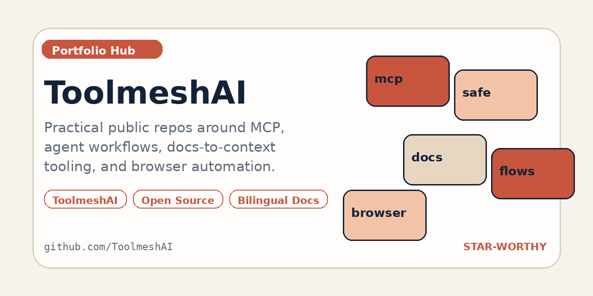

[English](./README.md)

# ToolmeshAI

围绕 MCP、agent workflow、docs-to-context 工具和浏览器自动化的实用型公开仓库集合。

如果你是第一次来到这里，建议先看 [`mcp-saas-foundry`](https://github.com/ToolmeshAI/mcp-saas-foundry)。

## 快速导航

- [Profile 发布说明](./docs/releases/v0.1.0.md)
- [Now / 当前聚焦](./docs/now.md)
- [Launch Kit / 分发包](./docs/launch/README.md)
- [支持说明](./SUPPORT.md)
- [安全策略](./SECURITY.md)
- [行为准则](./CODE_OF_CONDUCT.md)

## 当前重点

现在更强调把少量彼此关联的仓库打磨清楚，而不是同时铺很多松散实验。

- 面向生产使用的 MCP 基础设施与仓库骨架
- 更安全的 MCP 与 agent 配置
- 把原始文档整理成 AI 可直接消费上下文的工具链
- 短小、可复用、适合落地的 browser agent recipes

## 重点仓库

- [`mcp-saas-foundry`](https://github.com/ToolmeshAI/mcp-saas-foundry)
  面向 SaaS 场景的 MCP Server 蓝图，也是这组仓库的主轴项目。
- [`safe-mcp-config`](https://github.com/ToolmeshAI/safe-mcp-config)
  用来提前发现明显 MCP 配置风险的小型安全工具。
- [`docs-to-context`](https://github.com/ToolmeshAI/docs-to-context)
  把源文档整理成适合 AI 系统直接使用的 Markdown 上下文。
- [`awesome-mcp-workflows`](https://github.com/ToolmeshAI/awesome-mcp-workflows)
  中英双语整理真实 MCP 工作流、服务模式与可落地方向。
- [`browser-agent-recipes`](https://github.com/ToolmeshAI/browser-agent-recipes)
  面向 agent workflow 的可复用浏览器自动化 recipe。

## 为什么值得关注

- 这些仓库是互相支撑的一组作品，不是彼此割裂的 demo
- 更强调可用的 alpha 质量，而不是空壳 scaffold
- 采用英文主 README 与中文镜像，兼顾 GitHub 发现和中文传播

## 更新节奏

- 当前按少量重点仓库分批推进
- 只有在仓库有实质变化时才更新 README 与定位说明
- 新公开项目会慢一点发，但会尽量和现有作品集形成连接

这个主页会故意保持简短，细节放在各仓库 README、发布说明和 now 页面里。
